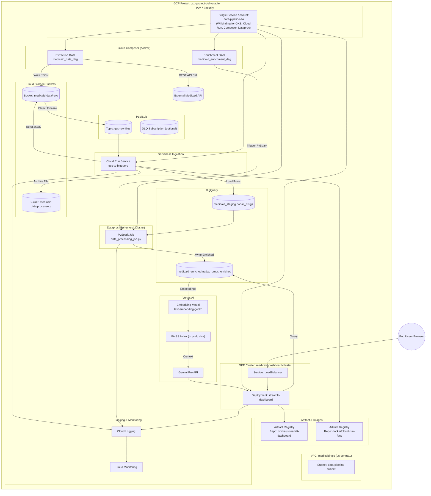
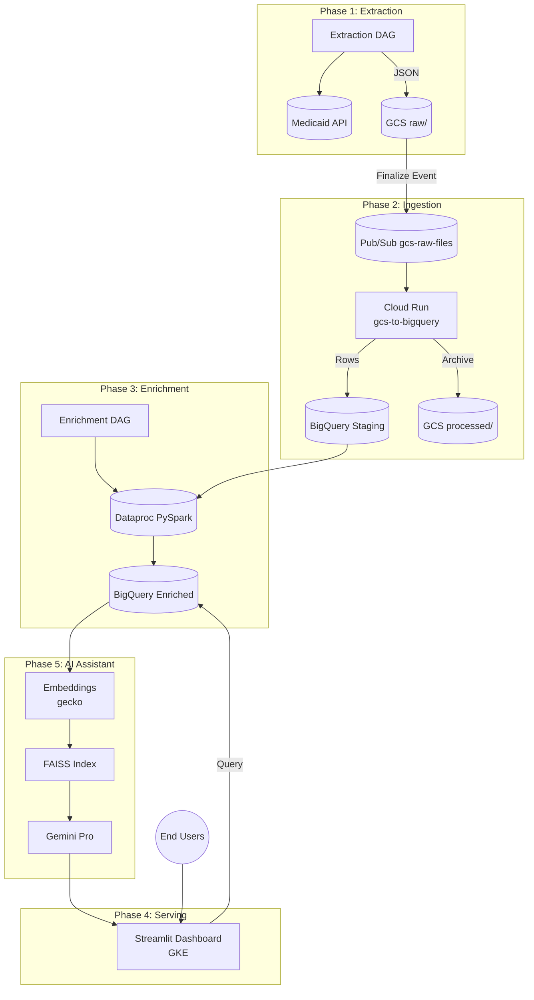

# Medicaid Drug Data Pipeline - GCP

Production-grade, event-driven data pipeline for extracting, processing, enriching, and visualizing Medicaid drug pricing data on Google Cloud Platform.

## 🎯 Project Overview

This project implements a complete end-to-end, automated data pipeline with AI capabilities:

1. **Extract** - Airflow DAG orchestrates API data extraction from Medicaid
2. **Store** - Raw JSON data stored in GCS with Pub/Sub notifications
3. **Load** - Event-driven Cloud Run Function loads data to BigQuery staging
4. **Enrich** - Dataproc PySpark job transforms and enriches data
5. **Visualize** - Streamlit dashboard on GKE with real-time analytics
6. **AI Assistant** - RAG-powered chatbot using Vertex AI for natural language queries

## 🏗️ System Architecture (Physical Deployment)



ASCII Fallback (Physical Overview):
```
[End Users] -> [GKE LB Service] -> [Streamlit Pods] -> [BigQuery Enriched]
Extraction DAG -> Medicaid API -> GCS raw/ -> Pub/Sub -> Cloud Run -> BigQuery Staging -> GCS processed/
Enrichment DAG -> Dataproc PySpark -> BigQuery Enriched
BigQuery Enriched -> Embeddings -> FAISS -> Gemini Pro -> Streamlit Chatbot
Single Service Account (medicaid-pipeline-sa) via Workload Identity grants access to: GCS, Pub/Sub, BigQuery, Dataproc, Vertex AI
```

Physical Characteristics:
- Region: us-central1  
- Single Service Account simplifies IAM; ensure scoped roles (Storage Object Viewer, Pub/Sub Subscriber, BigQuery Data Editor, Dataproc Worker, Vertex AI User)  
- Event-driven ingestion decoupled via Pub/Sub  
- Ephemeral Dataproc cluster lowers cost  
- Streamlit on GKE for scalable presentation & chatbot integration  
- Shared enriched dataset powers both analytics & RAG  

## 🔄 Data Flow Diagram



Flow Steps:
1. DAG pulls API -> stores JSON.
2. GCS finalize -> Pub/Sub event.
3. Cloud Run validates + loads staging; archives.
4. Enrichment DAG triggers Dataproc -> enriched table.
5. Dashboard queries enriched data.
6. RAG builds embeddings + FAISS; Gemini answers.
7. Users view charts & chat.

## � Component Details

### 1️⃣ Data Extraction (Cloud Composer)
- **File**: `composer/dags/medicaid_data_dag.py`
- **Trigger**: Scheduled (e.g., daily)
- **Process**: Calls Medicaid API → Saves JSON to GCS raw/
- **Output**: `gs://medicaid-data/raw/drug_data_YYYYMMDD.json`

### 2️⃣ Event-Driven Ingestion
- **Pub/Sub**: Triggers on GCS Object Finalize
- **Cloud Run Function**: `cloud-functions/gcs-to-bq/main.py`
  - Reads JSON from GCS
  - Loads to BigQuery staging
  - Moves file to processed/

### 3️⃣ Data Enrichment (Dataproc)
- **Orchestration**: `composer/dags/medicaid_enrichment_dag.py`
- **Job**: `dataproc/data_processing_job.py` (PySpark)
  - Parses drug names into components
  - Maps explanation codes
  - Writes to enriched table

### 4️⃣ Dashboard (GKE)
- **App**: `dashboard/app.py` (Streamlit)
- **Deployment**: Docker → Artifact Registry → GKE
- **Features**: Charts, filters, real-time BigQuery queries, AI chatbot

### 5️⃣ RAG AI System (Vertex AI)
- **Notebook**: `notebooks/drug_rag_system.ipynb`
- **Components**: Embeddings (Gecko) + Vector Store (FAISS) + LLM (Gemini)
- **Integration**: Chatbot in Streamlit dashboard

## �📦 Project Structure

```
GCS_Project/
├── cloud-functions/
│   └── gcs-to-bq/
│       └── main.py                      # Event-driven ingestion function
│
├── dataproc/
│   └── data_processing_job.py           # PySpark enrichment job
│
├── composer/
│   └── dags/
│       ├── medicaid_data_dag.py         # Extraction DAG
│       └── medicaid_enrichment_dag.py   # Enrichment DAG
│
├── dashboard/
│   ├── app.py                           # Streamlit dashboard
│   ├── requirements.txt
│   ├── Dockerfile
│   ├── k8s/                             # Kubernetes manifests
│   ├── deploy-gke.ps1                   # Deployment script (Windows)
│   ├── build-image.ps1                  # Build script (Windows)
│   ├── verify-setup.ps1                 # Setup verification
│   ├── manage-dashboard.ps1             # Management script
│   ├── QUICKSTART.md                    # 5-minute deployment guide
│   ├── README.md                        # Complete dashboard docs
│   ├── DEPLOYMENT.md                    # Detailed deployment
│   └── TOOLKIT.md                       # Complete script reference
│
├── notebooks/                           # NEW: RAG AI System
│   ├── drug_rag_system.ipynb           # Complete RAG implementation
│   ├── README.md                        # RAG documentation
│   ├── QUICKSTART.md                    # 15-minute setup guide
│   ├── DEPLOYMENT_GUIDE.md              # Production deployment
│   ├── OVERVIEW.md                      # Architecture details
│   ├── requirements.txt                 # Python dependencies
│   ├── rag_api.py                       # FastAPI service
│   ├── Dockerfile                       # Container for API
│   └── setup_rag.py                     # Automated setup
│
├── scripts/
│   ├── setup-gcs.sh                     # GCS bucket setup
│   ├── setup-bigquery.sh                # BigQuery setup
│   └── setup-dataproc.sh                # Dataproc setup
│
├── cloudbuild.yaml                      # Cloud Build config
├── .gitignore                           # Git exclusions
└── README.md                            # This file
```

## 🚀 Quick Start

### Prerequisites

- ✅ Google Cloud SDK (`gcloud`) installed
- ✅ Authenticated: `gcloud auth login`
- ✅ Project: `gcp-project-deliverable`
- ✅ APIs enabled: Composer, Dataproc, GKE, Cloud Run, Pub/Sub, Artifact Registry

### Setup Pipeline

```bash
# 1. Setup GCS buckets and Pub/Sub
./scripts/setup-gcs.sh

# 2. Setup BigQuery datasets and tables
./scripts/setup-bigquery.sh

# 3. Deploy Cloud Run Function
cd cloud-functions/gcs-to-bq
gcloud functions deploy gcs-to-bigquery \
  --runtime python310 \
  --trigger-topic gcs-raw-files \
  --entry-point process_gcs_file

# 4. Deploy Airflow DAGs to Composer
gcloud composer environments storage dags import \
  --environment medicaid-composer \
  --location us-central1 \
  --source composer/dags/

# 5. Deploy Dashboard to GKE
cd dashboard
./deploy-gke.ps1
```

### Test the Pipeline

```bash
# Trigger extraction DAG
gcloud composer environments run medicaid-composer \
  --location us-central1 \
  dags trigger -- medicaid_data_dag

# Monitor progress
# 1. Check GCS for raw files
gsutil ls gs://medicaid-data/raw/

# 2. Check BigQuery staging
bq query --use_legacy_sql=false \
  'SELECT COUNT(*) FROM medicaid_staging.nadac_drugs'

# 3. Trigger enrichment
gcloud composer environments run medicaid-composer \
  --location us-central1 \
  dags trigger -- medicaid_enrichment_dag

# 4. Check enriched data
bq query --use_legacy_sql=false \
  'SELECT COUNT(*) FROM medicaid_enriched.nadac_drugs_enriched'

# 5. Access dashboard
kubectl get service streamlit-dashboard
```

## 🔧 Configuration

### GCP Resources

| Resource | Name/ID | Purpose |
|----------|---------|---------|
| Project | `gcp-project-deliverable` | Main GCP project |
| GCS Bucket (Raw) | `medicaid-data/raw/` | Raw JSON files |
| GCS Bucket (Processed) | `medicaid-data/processed/` | Archived files |
| Pub/Sub Topic | `gcs-raw-files` | Event notifications |
| Cloud Run Function | `gcs-to-bigquery` | Event-driven ingestion |
| BigQuery Dataset (Staging) | `medicaid_staging` | Raw data tables |
| BigQuery Table (Staging) | `nadac_drugs` | Staging table |
| BigQuery Dataset (Enriched) | `medicaid_enriched` | Processed data |
| BigQuery Table (Enriched) | `nadac_drugs_enriched` | Enriched table |
| Composer Environment | `medicaid-composer` | Airflow orchestration |
| Dataproc Cluster | Ephemeral | PySpark processing |
| GKE Cluster | `medicaid-dashboard-cluster` | Dashboard hosting |
| Artifact Registry | `docker` | Container images |

## 🎯 Key Features

### Event-Driven Architecture
✅ **Automatic Processing**: Files uploaded to GCS trigger automatic ingestion  
✅ **Scalable**: Pub/Sub handles high-volume events  
✅ **Reliable**: Dead letter queues for failed messages  
✅ **Auditable**: Cloud Logging tracks all events

### Orchestrated Workflows
✅ **Scheduled Extraction**: Daily API calls via Airflow  
✅ **Automated Enrichment**: Triggered after ingestion  
✅ **Monitoring**: Airflow UI shows pipeline status  
✅ **Retries**: Automatic retry on failures

### Production-Ready Dashboard
✅ **Containerized**: Docker image in Artifact Registry  
✅ **Scalable**: Auto-scales 1-4 replicas on GKE  
✅ **Secure**: Workload Identity (no service account keys)  
✅ **Real-time**: Live BigQuery queries

### AI-Powered Insights
✅ **Natural Language Queries**: Ask questions in plain English  
✅ **Semantic Search**: Understands intent, not just keywords  
✅ **Conversational**: Multi-turn dialogues with context  
✅ **Accurate**: Cites source drugs in responses

## 📊 Data Pipeline Details

### Phase 1: Extraction (Airflow DAG)
**Frequency**: Scheduled (e.g., daily at 2 AM UTC)  
**File**: `composer/dags/medicaid_data_dag.py`

**Steps**:
1. Call Medicaid Drug Pricing API (REST API)
2. Receive JSON response with drug data
3. Save to GCS: `gs://medicaid-data/raw/drug_data_YYYYMMDD_HHMMSS.json`
4. Log success/failure to Cloud Logging

**Sample Data**:
```json
{
  "ndc": "00000-0000-00",
  "ndc_description": "IBUPROFEN 200MG TABLET",
  "nadac_per_unit": "0.03456",
  "effective_date": "2024-01-01",
  ...
}
```

### Phase 2: Ingestion (Event-Driven)
**Trigger**: GCS Object Finalize Event  
**Function**: `cloud-functions/gcs-to-bq/main.py`

**Process Flow**:
1. File saved to `raw/` folder → Pub/Sub notification sent
2. Cloud Run Function triggered by Pub/Sub message
3. Function reads file path from event
4. Downloads and parses JSON from GCS
5. Validates data schema
6. Inserts records into `medicaid_staging.nadac_drugs`
7. Moves file to `processed/` folder
8. Updates processing log

**Benefits**:
- ⚡ **Real-time**: Processes files immediately
- 🔄 **Automatic**: No manual intervention needed
- 📈 **Scalable**: Handles multiple files concurrently
- 🛡️ **Reliable**: Dead letter queue for failed events

### Phase 3: Enrichment (Dataproc PySpark)
**Trigger**: Manual or scheduled via Airflow DAG  
**File**: `dataproc/data_processing_job.py`  
**Orchestration**: `composer/dags/medicaid_enrichment_dag.py`

**Processing Steps**:
1. **Read Staging Data**:
   ```python
   staging_df = spark.read.format("bigquery") \
       .option("table", "medicaid_staging.nadac_drugs") \
       .load()
   ```

2. **Parse Drug Names**:
   - Input: `"IBUPROFEN 200MG TABLET"`
   - Extract:
     - `drug_name`: "IBUPROFEN"
     - `drug_strength`: "200"
     - `drug_dosage`: "MG"
     - `drug_form`: "TABLET"

3. **Map Explanation Codes**:
   - Input: `explanation_code` = "1,2"
   - Output: `explanation_code_description` = "Calculated from pharmacy survey | Carried forward"

4. **Add Metadata**:
   - `enriched_timestamp`: Current timestamp
   - Data quality flags

5. **Write to Enriched Table**:
   ```python
   enriched_df.write.format("bigquery") \
       .option("table", "medicaid_enriched.nadac_drugs_enriched") \
       .save()
   ```

**Performance**:
- 50,000 records: ~5-10 minutes
- Cluster: 1 master + 2 workers (auto-scaled)
- Cost: ~$0.50-1.00 per run

### Phase 4: Visualization (Streamlit on GKE)
**Deployment**: Docker → Artifact Registry → GKE  
**File**: `dashboard/app.py`

**Build & Deploy Process**:
```powershell
# 1. Build Docker image
docker build -t us-central1-docker.pkg.dev/gcp-project-deliverable/docker/streamlit-dashboard:latest .

# 2. Push to Artifact Registry
docker push us-central1-docker.pkg.dev/gcp-project-deliverable/docker/streamlit-dashboard:latest

# 3. Deploy to GKE
kubectl apply -f k8s/deployment.yaml
kubectl apply -f k8s/service.yaml

# 4. Get external IP
kubectl get service streamlit-dashboard
```

**Features**:
- 📊 **Interactive Charts**: Bar, pie, line, scatter plots
- 🔍 **Dynamic Filters**: Drug name, date range, form, classification
- 📈 **Real-time Queries**: Live BigQuery data
- 💬 **AI Chatbot**: Integrated RAG system
- 🔐 **Secure**: Workload Identity authentication
- ⚡ **Auto-scaling**: 1-4 replicas based on CPU

**Dashboard Queries**:
```python
# Example: Get average price by drug
query = f"""
    SELECT drug_name, AVG(nadac_per_unit) as avg_price
    FROM `medicaid_enriched.nadac_drugs_enriched`
    WHERE drug_name IS NOT NULL
    GROUP BY drug_name
    ORDER BY avg_price DESC
    LIMIT 20
"""
df = client.query(query).to_dataframe()
```

### Phase 5: AI Assistant (RAG System)
**Notebook**: `notebooks/drug_rag_system.ipynb`  
**Technology**: Vertex AI + FAISS

**RAG Pipeline**:
1. **Load Data**: Read enriched table from BigQuery
2. **Generate Embeddings**: Convert drugs to 768-dim vectors (Vertex AI)
3. **Build Vector Store**: Create FAISS index for similarity search
4. **Query Processing**: 
   - User asks question
   - Generate query embedding
   - Search top-k similar drugs
   - Format context
5. **Answer Generation**: Gemini Pro creates natural language response

**Example Interaction**:
```
User: "What are affordable pain medications in tablet form?"
RAG:  "Based on the Medicaid database, here are affordable pain 
       medications available in tablet form:
       
       1. Ibuprofen 200MG Tablet - $0.03 per tablet (NDC: 12345-678-90)
          Available at: Community pharmacy
          Type: Over-the-counter
       
       2. Acetaminophen 325MG Tablet - $0.02 per tablet (NDC: 23456-789-01)
          Available at: Community pharmacy
          Type: Over-the-counter
       ..."
```

**Integration with Dashboard**:
- Chatbot widget in Streamlit UI
- Multi-turn conversations
- Source citations with drug details
- Context-aware follow-ups

**See [notebooks/README.md](notebooks/README.md) for setup guide.**

## 🔧 Management & Monitoring

### Monitoring Dashboard Access

```bash
# Get dashboard URL
kubectl get service streamlit-dashboard -o jsonpath='{.status.loadBalancer.ingress[0].ip}'

# Check pod status
kubectl get pods -l app=streamlit-dashboard

# View logs
kubectl logs -l app=streamlit-dashboard --tail=100

# Describe service
kubectl describe service streamlit-dashboard
```

### Airflow Monitoring

```bash
# Access Composer/Airflow UI
gcloud composer environments describe medicaid-composer \
  --location us-central1 \
  --format="get(config.airflowUri)"

# Trigger DAG manually
gcloud composer environments run medicaid-composer \
  --location us-central1 \
  dags trigger -- medicaid_data_dag

# Check DAG run status
gcloud composer environments run medicaid-composer \
  --location us-central1 \
  dags list-runs -- --dag-id medicaid_data_dag
```

### Cloud Function Monitoring

```bash
# View function logs
gcloud functions logs read gcs-to-bigquery --limit 50

# Get function details
gcloud functions describe gcs-to-bigquery

# Check invocations
gcloud functions logs read gcs-to-bigquery \
  --filter="severity>=WARNING" \
  --limit 100
```

### BigQuery Monitoring

```bash
# Check staging table
bq show medicaid_staging.nadac_drugs
bq query --use_legacy_sql=false \
  'SELECT COUNT(*), MAX(effective_date) FROM medicaid_staging.nadac_drugs'

# Check enriched table
bq show medicaid_enriched.nadac_drugs_enriched
bq query --use_legacy_sql=false \
  'SELECT COUNT(*), MAX(enriched_timestamp) FROM medicaid_enriched.nadac_drugs_enriched'

# View recent data
bq query --use_legacy_sql=false \
  'SELECT * FROM medicaid_enriched.nadac_drugs_enriched 
   ORDER BY enriched_timestamp DESC LIMIT 10'
```

### GCS Monitoring

```bash
# List raw files
gsutil ls -lh gs://medicaid-data/raw/

# List processed files
gsutil ls -lh gs://medicaid-data/processed/

# Check bucket size
gsutil du -sh gs://medicaid-data/

# View file content
gsutil cat gs://medicaid-data/raw/drug_data_20240101_120000.json | head
```

## 🚨 Troubleshooting

### Dashboard Issues

```powershell
cd dashboard

# Check status
.\manage-dashboard.ps1 -Action status

# View logs
.\manage-dashboard.ps1 -Action logs

# Verify setup
.\verify-setup.ps1

# Restart
.\manage-dashboard.ps1 -Action restart
```

### Pub/Sub Not Triggering

```bash
# Verify Pub/Sub topic exists
gcloud pubsub topics describe gcs-raw-files

# Check subscriptions
gcloud pubsub subscriptions list --filter="topic=gcs-raw-files"

# Verify notification configuration
gsutil notification list gs://medicaid-data/raw/

# Test manually
gsutil notification create -t gcs-raw-files \
  -f json -e OBJECT_FINALIZE gs://medicaid-data/raw/
```

### Cloud Function Errors

```bash
# View detailed logs
gcloud functions logs read gcs-to-bigquery \
  --filter="severity>=ERROR" \
  --format="table(timeUtc, severity, log)"

# Check function configuration
gcloud functions describe gcs-to-bigquery \
  --format="yaml(environmentVariables, serviceAccountEmail)"

# Redeploy function
cd cloud-functions/gcs-to-bq
gcloud functions deploy gcs-to-bigquery \
  --runtime python310 \
  --trigger-topic gcs-raw-files \
  --entry-point process_gcs_file
```

### Dataproc Job Failures

```bash
# List recent jobs
gcloud dataproc jobs list --region=us-central1 --limit=10

# View job details
gcloud dataproc jobs describe JOB_ID --region=us-central1

# View job logs
gcloud dataproc jobs wait JOB_ID --region=us-central1

# Check cluster status
gcloud dataproc clusters list --region=us-central1
```

### Authentication Issues

```bash
# Re-authenticate
gcloud auth login
gcloud auth application-default login

# Verify service account permissions
gcloud projects get-iam-policy gcp-project-deliverable

# Check Workload Identity binding
kubectl describe serviceaccount dashboard-ksa

# Verify GKE authentication
gcloud container clusters get-credentials medicaid-dashboard-cluster \
  --zone=us-central1-a
```
- **Auto-scaling** (1-4 replicas)

## 🤖 RAG AI Assistant Features ✨ (In Progress)!

The RAG (Retrieval-Augmented Generation) system enables natural language queries over your drug database:

### Key Features
- **Natural Language Q&A**: Ask questions in plain English
- **Semantic Search**: Understands intent, not just keywords
- **Context-Aware**: Multi-turn conversations with history
- **Source Citations**: Shows which drugs informed the answer
- **Configurable**: Adjust retrieval count and creativity

### Technology Stack
- **Embeddings**: Vertex AI text-embedding-gecko@003
- **Vector Store**: FAISS for fast similarity search
- **LLM**: Vertex AI Gemini Pro 1.5
- **Framework**: Complete Jupyter notebook + optional FastAPI

### Example Queries
```
"What are pain medications in tablet form?"
"Show me affordable antibiotics under $1"
"Compare generic vs brand blood pressure drugs"
"What injectable diabetes medications are available?"
```

### Quick Start
```bash
cd notebooks
python setup_rag.py
jupyter notebook drug_rag_system.ipynb
```

**See [notebooks/QUICKSTART.md](notebooks/QUICKSTART.md) for 15-minute setup guide.**

## � Estimated Costs

**Monthly (Moderate Usage)**:
- Cloud Composer: $300-400
- Dataproc: $50-100 (ephemeral)
- BigQuery: $30-60
- GKE: $100-150
- Cloud Run Functions: $5-10
- Vertex AI (RAG): $30-80
- **Total**: ~$521-815/month

**Cost Optimization**:
- Use preemptible VMs for Dataproc
- Lifecycle policies for GCS
- BigQuery clustering/partitioning
- Scale Composer during off-hours

## 🧪 Technology Stack

### Pipeline
- Cloud Composer (Airflow 2.x), Dataproc (Spark 3.x), BigQuery, GCS, Pub/Sub, Cloud Run Functions

### Dashboard
- Streamlit, Plotly, Docker, GKE, Artifact Registry

### AI
- Vertex AI (Gecko embeddings, Gemini Pro), FAISS, Jupyter

---

**Built with ❤️ on Google Cloud Platform**

All scripts are in the `dashboard/` directory:

```powershell
cd dashboard

# Verify prerequisites
.\verify-setup.ps1

# Build Docker image (uses Cloud Build, no local Docker!)
.\build-image.ps1

# Deploy everything to GKE
.\deploy-gke.ps1

# Daily operations
.\manage-dashboard.ps1 -Action status      # Check status
.\manage-dashboard.ps1 -Action logs        # View logs
.\manage-dashboard.ps1 -Action restart     # Restart
.\manage-dashboard.ps1 -Action scale -Replicas 3   # Scale
.\manage-dashboard.ps1 -Action url         # Get URL
```

## 📖 Documentation

### Dashboard
- **[QUICKSTART.md](dashboard/QUICKSTART.md)** - 5-minute deployment guide ⚡
- **[README.md](dashboard/README.md)** - Complete dashboard documentation
- **[DEPLOYMENT.md](dashboard/DEPLOYMENT.md)** - Detailed deployment instructions
- **[TOOLKIT.md](dashboard/TOOLKIT.md)** - Complete script reference

### Pipeline
- **[Dataproc Job](dataproc/data_processing_job.py)** - PySpark enrichment logic
- **[Extraction DAG](composer/dags/medicaid_data_dag.py)** - API extraction
- **[Enrichment DAG](composer/dags/medicaid_enrichment_dag.py)** - Data processing

## 🔧 Configuration

### GCP Resources

| Resource | Name/ID | Purpose |
|----------|---------|---------|
| Project | `gcp-project-deliverable` | Main GCP project |
| GCS Bucket | `gcp-project-deliverable-medicaid-data` | Raw data storage |
| BigQuery Dataset | `medicaid_data` | All tables |
| BigQuery Table (Staging) | `medicaid_raw` | Raw API data |
| BigQuery Table (Enriched) | `enriched_drug_data` | Processed data |
| Dataproc Cluster | `medicaid-processing-cluster` | PySpark processing |
| GKE Cluster | `medicaid-dashboard-cluster` | Dashboard hosting |
| Service Account | `data-pipeline-sa` | Pipeline execution |

## 🚨 Troubleshooting

### Dashboard Issues

```powershell
cd dashboard

# Check status
.\manage-dashboard.ps1 -Action status

# View logs
.\manage-dashboard.ps1 -Action logs

# Verify setup
.\verify-setup.ps1

# Restart
.\manage-dashboard.ps1 -Action restart
```

### Authentication Issues

```powershell
# Re-authenticate
gcloud auth login
gcloud auth application-default login

# Verify service account permissions
gcloud projects get-iam-policy gcp-project-deliverable
```

### More Help

See detailed troubleshooting in:
- [dashboard/DEPLOYMENT.md](dashboard/DEPLOYMENT.md) - Deployment issues
- [dashboard/TOOLKIT.md](dashboard/TOOLKIT.md) - Script issues

## 💰 Cost Estimate

### Monthly Costs (Approximate)

| Service | Cost |
|---------|------|
| GKE (2 e2-standard-2 nodes) | ~$150 |
| Cloud Storage | ~$5 |
| BigQuery (storage + queries) | ~$10-20 |
| Dataproc (on-demand) | ~$5-10 |
| LoadBalancer | ~$18 |
| Cloud Build | Free tier |
| **Total** | **~$190-200/month** |

### Cost Optimization

```powershell
# Scale down when not in use
.\dashboard\manage-dashboard.ps1 -Action scale -Replicas 0

# Use smaller machines
--machine-type=e2-small

# Delete cluster when not needed
gcloud container clusters delete medicaid-dashboard-cluster --region=us-central1
```

## 🔐 Security

### Implemented
- ✅ Workload Identity (no service account keys)
- ✅ Least privilege IAM roles
- ✅ Secrets excluded from Git/Docker
- ✅ Resource limits on pods
- ✅ Health checks

### Recommended Enhancements
- [ ] Enable HTTPS with managed certificates
- [ ] Add Cloud IAP for authentication
- [ ] Use Secret Manager
- [ ] Configure VPC Service Controls
- [ ] Enable Binary Authorization

## 🎓 Next Steps

1. ✅ **Deploy Dashboard:** `cd dashboard && .\deploy-gke.ps1`
2. ⬜ **Add HTTPS:** Configure Ingress with SSL
3. ⬜ **Add Authentication:** Use Cloud IAP
4. ⬜ **Set up Monitoring:** Enable Cloud Monitoring
5. ⬜ **Add CI/CD:** Automate with Cloud Build triggers
6. ⬜ **Optimize Costs:** Right-size resources

## 📞 Support

For issues:
1. Check documentation (QUICKSTART, README, DEPLOYMENT, TOOLKIT)
2. Run `.\dashboard\verify-setup.ps1`
3. View logs: `.\dashboard\manage-dashboard.ps1 -Action logs`
4. Check GCP Console for service status

## 🏆 Key Features

- ✅ Production-grade data pipeline
- ✅ Automated with Airflow/Composer
- ✅ Scalable processing with Dataproc
- ✅ Interactive Streamlit dashboard
- ✅ Kubernetes deployment (GKE)
- ✅ Secure Workload Identity
- ✅ Auto-scaling and health checks
- ✅ **No Docker required** (Cloud Build)
- ✅ Easy management scripts
- ✅ Comprehensive documentation

---

**Ready to deploy?** Start here: [dashboard/QUICKSTART.md](dashboard/QUICKSTART.md)
